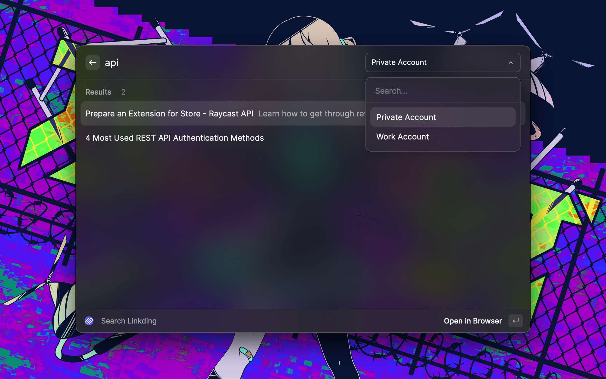
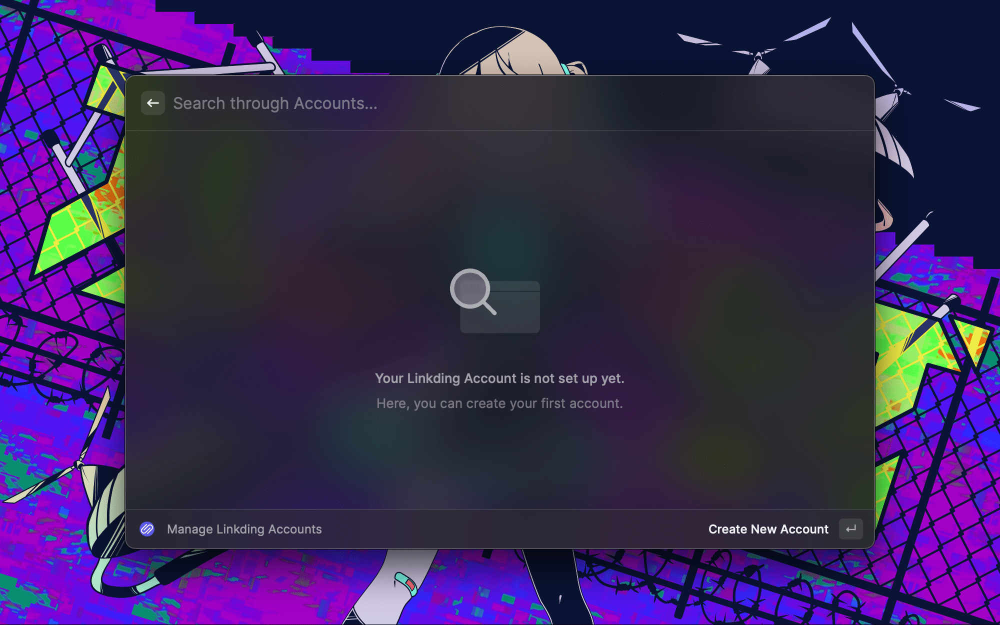
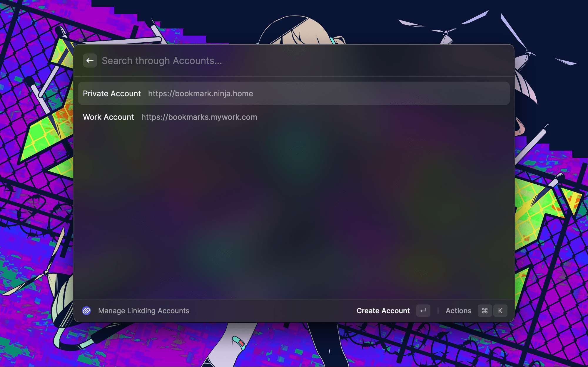

# Linkding

Uses Raycast to search through Linking Bookmarks.

## Screenshots

## Features

- Support Bookmark search through multiple Linkding Accounts and Servers
- Open Bookmarks in the Browser
- Copy Bookmarks to Clipboard
- Create and delete Bookmarks in the Extension

## Notice

The Linkding API Key and Server URL from your Linkding instance are needed to use this extension.

## Planned Features

- Update Bookmarks in extension

## Contributing

Contributions are always welcome!
